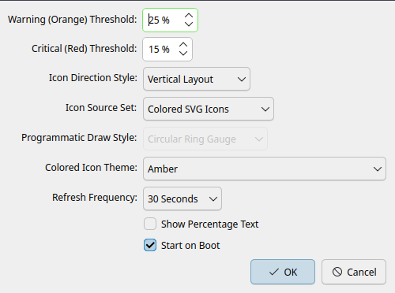
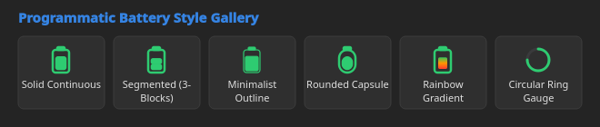
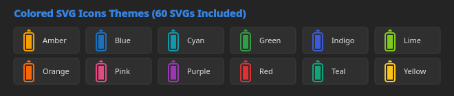

# Logitech Battery Monitor System Tray

[](https://www.python.org/)
[](https://pypi.org/project/PySide6/)
[](https://kde.org/plasma-desktop/)
[](LICENSE)

A lightweight, feature-rich system tray battery monitor for Logitech wireless mice (such as the G502 X, PRO X Superlight, G305, etc.) on Linux desktops. Built natively with Python and PySide6/PyQt5, it provides real-time charge monitoring, battery depletion rate estimation, custom vector layouts, and colored icon themes with zero background CPU overhead.

---

## Previews

### Settings & Preferences


### Programmatic Battery Layout Styles


### Colored SVG Theme Icons (60 Vector SVGs Included)


---

## Features

- **Direct HID Probing**: Queries battery percentages and charging states directly from Logitech USB wireless receivers via HID++ protocols.
- **Hours-Remaining Estimator**: Tracks historical discharge rates over time and calculates a moving average to display estimated remaining battery life (`~72h left`).
- **Last Charge Timestamp Tracking**: Records the exact moment the battery was charged to $\ge 95\%$, persisting the time elapsed (`Charged to 95%: 2d 6h ago`) across system reboots.
- **6 Programmatic Vector Styles**:
  - **Solid Continuous**: Standard continuous level fill bar.
  - **Segmented (3 Blocks)**: Renders low, medium, and high charge levels inside three distinct visual segment slots.
  - **Minimalist Outline**: Thin container border outline with a tighter spacing fill bar.
  - **Rounded Capsule**: Smooth modern pill capsule shapes for both container and fill bars.
  - **Rainbow Gradient**: Linear color gradient fading from Red to Orange to Green based on charge levels.
  - **Circular Ring Gauge**: Smartwatch-inspired 360-degree progress arc dial.
- **60 Included Colored SVG Theme Icons**: Choose between dynamic state-based colors or 12 fixed color palettes (Amber, Blue, Cyan, Green, Indigo, Lime, Orange, Pink, Purple, Red, Teal, Yellow).
- **Vertical & Horizontal Layouts**: Support for both vertical and horizontal tray orientations with automatic $90^\circ$ vector rotation and upright text overlays.
- **Real-Time Live Previews**: Changes in the Preferences dialog update the system tray icon instantly in real-time.
- **Native KDE Breeze Theme**: Inherits system dark/light palettes automatically.
- **Autostart Support**: Single-click configuration to launch automatically on system boot.

---

## Requirements & Dependencies

- **Python**: 3.8 or higher
- **GUI Framework**: `PySide6` (or `PyQt5` / `PyQt6`)
- **System Permissions**: Read/Write access to `/dev/hidraw*` device nodes (configured via udev rule).

---

## Installation

### 1. Clone Repository
```bash
git clone https://github.com/your-username/logitech-battery-tray.git
cd logitech-battery-tray
```

### 2. Install Python Dependencies
```bash
pip install PySide6 hidapi
```

### 3. Setup USB udev Permissions (Linux)
To allow querying Logitech receiver devices without running as root, add your user to the `input` or `plugdev` group and install a udev rule:

```bash
# Add udev rule for Logitech HID++ receivers
echo 'KERNEL=="hidraw*", SUBSYSTEM=="hidraw", ATTRS{idVendor}=="046d", MODE="0666"' | sudo tee /etc/udev/rules.d/99-logitech-wheel.rules

# Reload udev rules
sudo udevadm control --reload-rules
sudo udevadm trigger
```

---

## Usage

Run the tray application directly from terminal:
```bash
python3 logitech_battery.py
```

### System Tray Right-Click Menu
- **Logitech Device**: Device model name.
- **Battery Status**: Current percentage, remaining hours estimate, and charging state.
- **Charged to 95%**: Elapsed time since the battery was last fully charged.
- **Refresh Now**: Force an immediate battery query.
- **Refresh Interval**: Select polling interval (5s, 10s, 30s, 60s).
- **Start on Boot**: Enable/disable autostart entry in `~/.config/autostart`.
- **Preferences...**: Open the visual settings panel.

---

## Configuration

Settings are saved in standard INI format at:
`~/.config/logitech-battery-tray/Settings.conf`

---

## License

This project is licensed under the [MIT License](LICENSE).
